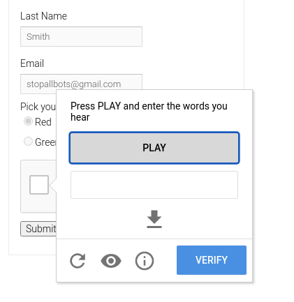

**Audio CAPTCHA**

**Example:**

• Plays garbled numbers/letters (e.g., "5... L... 3").
    

**Where you see it:**
 
 • Government sites, accessibility-compliant platforms.
 
    

**Looks like:**

**Bypass Methods:**

• Speech-to-text tools (Google Speech Recognition).)

