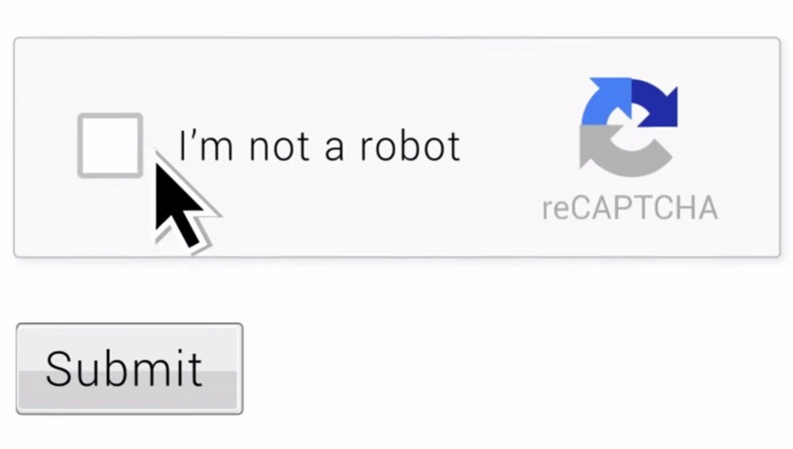

**Checkbox CAPTCHAs (reCAPTCHA v2)**

**Example:**

• "I'm not a robot" Checkbox – Analyzes clicks and browser behavior.

• Sometimes auto-verifies; other times triggers image challenges.

**Where you see it:**

• Almost every modern website (Gmail, Facebook, Cloudflare-protected sites).
Here is a sample captcha image:

**Looks like:**

**Bypass Methods:**

• Mimic human mouse movements (Puppeteer-extra-stealth).

• Solve underlying challenges automatically (e.g., anti-captcha APIs).
