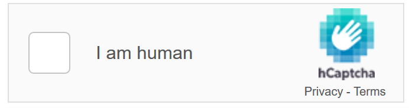

**hCAPTCHA**

**Example:**

• Similar to reCAPTCHA but says "hCAPTCHA" at the bottom.
    

**Where you see it:**
 
 • Privacy-focused sites (DuckDuckGo, Cloudflare alternatives).
 
    

**Looks like:**

**Bypass Methods:**

•hCaptcha solvers (e.g., CapMonster).

• AI-based solvers (like Capsolver)

