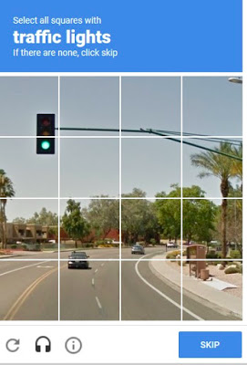

**Image-Based CAPTCHA (reCAPTCHA v2)**

**Example:**

  • "Select all squares with [object]" (e.g., traffic lights, buses).

  • Image Classification – "Pick the cat in these pictures."
  
**Where you see it:**

  • Google services, Shopify stores, ticket-booking sites.
  
    
 **Looks like:**
 

**Bypass Methods:**

• Machine learning models (YOLO, CNN).

• Human-solving services (2Captcha, DeathByCaptcha).
