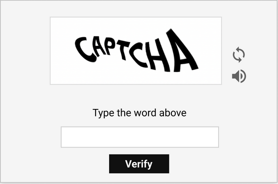

**Text-Based CAPTCHA**

• Distorted Letters/Numbers – Warped, overlapping, or noisy text.

• Math/Word Problems – Simple arithmetic or "type the word you see."

**Example:**

• Old-school distorted text (e.g., "G8HXK")

• Math problem (e.g., "What is 3 + 5?")
    

**Where you see it:**
 
 • Legacy websites, forums, or low-budget login pages.
 
    

**Looks like:**

**Bypass Methods:**

• OCR tools (Tesseract with preprocessing)

• AI-based solvers (like Capsolver)

